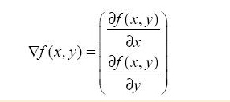

#第5章 Logistic回归
***
##本章内容

* Sigmoid函数和Logistic回归分类器
* 最优化理论初步
* 梯度下降最优化算法
* 数据中缺失项处理

###5.1 基于Logistic回归和Sigmoid函数的分类

**Logistic回归**
&emsp;&emsp;优点：计算代价不高，易于理解和实现
&emsp;&emsp;缺点：容易欠拟合，分类精度不高
&emsp;&emsp;适用数据类型：数值型和标称型数据
&emsp;&emsp;Sigmoid函数计算公式如下：
&emsp;&emsp;&emsp;&emsp;
&emsp;&emsp;函数图像如下：
&emsp;&emsp;&emsp;&emsp;

###5.2 基于最优化方法的最佳回归系数确定

####5.2.1 梯度上升法

&emsp;思想是：找到某函数的最大值
&emsp;函数*f(x,y)*的梯度由下式表示：
&emsp;&emsp;
&emsp;&emsp;
&emsp;梯度上升算法的迭代公式如下：
&emsp;&emsp;

####5.2.2 训练算法：使用梯度上升找到最佳参数

&emsp;梯度上升伪代码如下：
```
每个系数初始化为1
重复R次：
    计算整个数据集的梯度
    使用alpha*gradient更新回归系数的向量
    返回回归系数
```

####5.2.3 分析数据：画出决策边界

####5.2.4 训练算法：随机梯度上升


