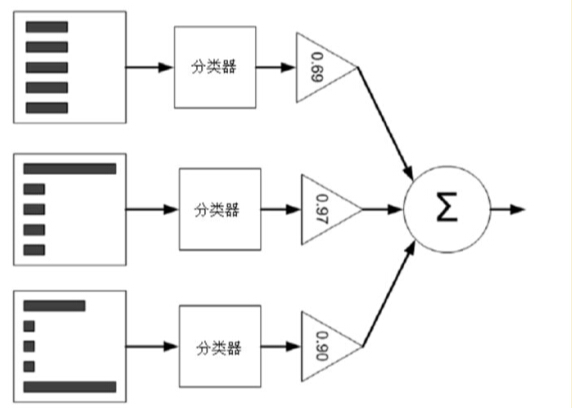

#第7章 利用AdaBoost元算法提高分类性能

##7.1 基于数据集多重抽样的分类器

&emsp;AdaBoost优点：泛化错误率低，易编码，可以应用在大部分分类器上，无参数调整
&emsp;&emsp;&emsp;缺点：对离群点敏感

###7.1.1 bagging:基于数据随机重抽样的分类器构建方法
&emsp;**自举汇聚法**，也叫bagging方法,是从原始数据集中选择S次后得到S个新的数据集的一种技术，先进的bagging方法，如**随机森林**

###7.1.2 boosting

##7.2 训练算法：基于错误提升分类器的性能

AdaBoost运行过程如下：
&emsp;训练数据中每个样本，并赋予其权重，这些权重构成向量D。开始，这些权重都初始化成相等值。
&emsp;首先，在训练数据上训练出一个弱分类器并计算分类器的错误率，然后在同一数据集上再次训练弱分类器。，为了从分类器中得到最终分类结果，AdaBoost为每个分类器都分配一个权重值alpha，这些alpha值是基于每个弱分类器的错误率进行计算的。其中，错误率$\varepsilon$的定义为：
$$\varepsilon=\frac{未正确分类的样本数目}{所有样本数目}$$
aplha的计算公式为：
$$\alpha=\frac{1}{2}ln\left(\frac{1-\varepsilon}{\varepsilon}\right)$$

AdaBoost算法的流程如下图所示：

**左边是数据集，其中直方图的不同宽度表示每个样例上的不同权重。在经过一个分类器之后，加权的预测结果会通过三角形中alpha值进行加权。每个三角形中输出的加权结果在圆形中求和，从而得到最终的输出结果**
计算出alpha值后，对权重向量D进行更新
如果某个样本呗正确分类，那么该样本的权重更改为：
$$D_{i}^{(t+1)}=\frac{D^{t}_{i}e^{-\alpha}}{Sum(D)}$$

如果某个样本被错分，那么该样本的权重更改为：

$$D_{i}^{(t+1)}=\frac{D^{t}_{i}e^{\alpha}}{Sum(D)}$$

##7.3 基于单层决策树构建弱分类器

这个程序的伪代码大致如下：
将最小错误率minError设为$+\infty$
```
对数据集中的每一个特征（第一层循环）：
    对每个步长（第二层循环）：
        对每个不等号（第三次循环）：
            建立一棵单层决策树并利用加权数据集对他进行测试

            如果错误率低于minError，则将当前单层决策树设为最佳单层决策树
返回最佳单层决策树
```
